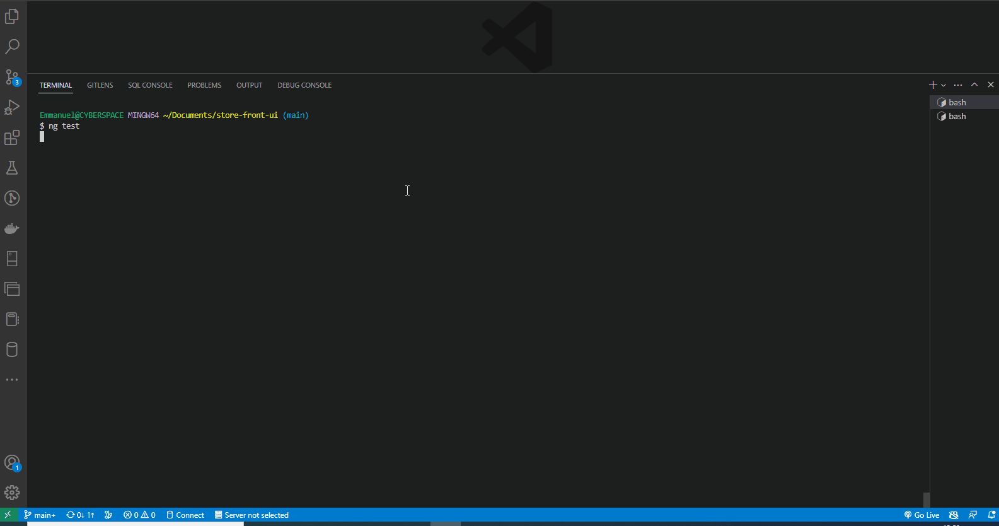

# store-front-ui Project Overview

store-front-ui is Angular application that allows users to view a list of available products to purchase, add them to a shopping cart, and ultimately complete the checkout process.

## Getting Started

- [x] Clone Repo: `git clone https://github.com/Emmanuel-Dominic/store-front-ui.git`
- [x] Install Package: `npm install`
- [x] Run Application: `ng serve`
- [x] Run Tests: `ng test`

## Project Overview

Below gif shows a single-page application that displays a rich, dynamic experience of how the web application works.

## Project features

Your application reflects the same user experience as that of a real-world e-commerce website, including a(n):

- **Product list** page, which displays the available products for the user to choose and add to their cart (in various quantities)
- **Product details** page, which displays more information about any particular product
- **Shopping cart**, which includes the products that the user has added to their cart
- **Checkout form**, which collects information about the user (e.g., name, address, payment details, etc.)
- **Order confirmation page**, which shows the outcome after the user completes the checkout process (i.e., submits the checkout form)

## Author

[Matembu Emmanuel Dominic](https://github.com/Emmanuel-Dominic)
